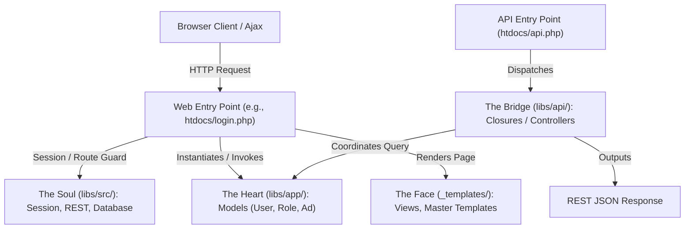
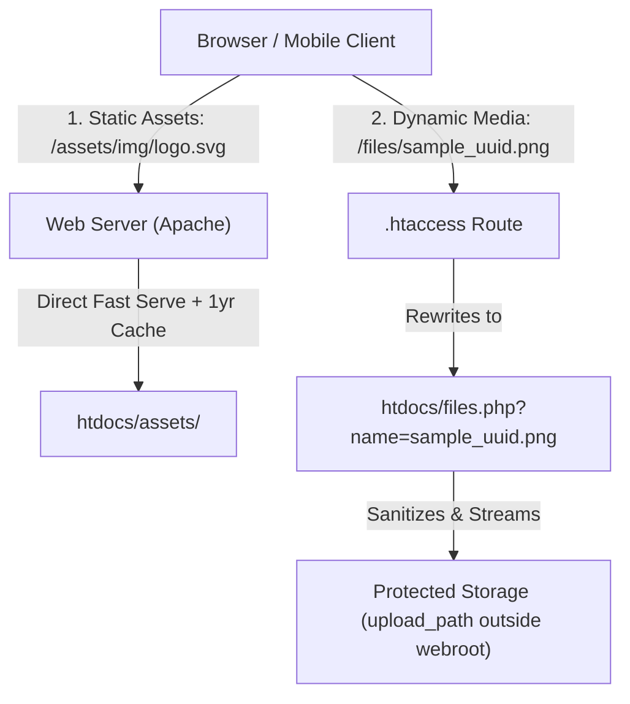

# Aether Catalyst: Developer & Framework Architecture Documentation

Welcome to the official developer documentation for the **Aether Catalyst Framework**. This guide is designed to help engineers understand the framework's internal architecture, folder layout, rendering pipelines, and instructions on how to adopt or migrate existing web projects to this architecture.

---

## 1. Architectural Philosophy: Soul, Heart, Bridge & Face

Aether Catalyst uses a highly optimized **Separation of Concerns (SoC)** model to split immutable core modules from project-specific domains, interfaces, and APIs. This ensures high code reusability, easy testing, and long-term maintainability.



### The Four Pillars of Aether Catalyst:

1. **The Soul (`libs/src/`)**: 
   - **Immutable Core Framework Code**. This contains the foundation of the framework engine: database wrappers, session abstraction, authentication logic, REST helpers, and shared utilities.
   - **Examples**: `Database.php`, `Session.php`, `REST.php`, `WebAPI.php`, `SupabaseClient.php`, `Mailer.php`.
   - *Rule*: Never insert project-specific tables or rules in this directory.

2. **The Heart (`libs/app/`)**:
   - **Project-Specific Domain Logic & Models**. This houses your application models and classes that manage business rules, database actions, calculations, and local queries.
   - **Examples**: `Product.php`, `Order.php`.

3. **The Bridge (`libs/api/`)**:
   - **API Controllers & Routing Endpoints**. Exposes project-specific REST API routing controllers which map requests to models and return clean JSON to the client.
   - **Examples**: Subdirectories matching functional areas, such as `libs/api/app_config/update.php` or `libs/api/users/list.php`.

4. **The Face (`_templates/`)**:
   - **Presentation Layer**. Contains only HTML markup, vanilla Javascript templates, CSS classes, and light PHP output commands (`echo`, `foreach`). It should not perform database operations, calculations, or authentication validations.

---

## 2. Directory Layout & Purpose

```
project-root/
├── htdocs/                      # Web Server Document Root (Only this is public-facing)
│   ├── _templates/              # Presentation views and layouts
│   │   ├── admin/               # Admin panel pages (dashboard, compliance, etc.)
│   │   ├── core/                # Reusable partials (_head.php, _nav.php, _footer.php)
│   │   ├── _master.php          # Main customer/user layout
│   │   └── _masterForAdmin.php  # Admin dashboard sidebar layout
│   ├── assets/                  # CSS styles, vanilla JS files, image vectors
│   ├── db/                      # Database structure files and migrations
│   ├── libs/                    # PSR-4 Autoloaded library files
│   │   ├── api/                 # API Endpoint actions (Closure-based)
│   │   ├── app/                 # Project-specific database model classes
│   │   └── src/                 # Framework engine core (Database, Session, REST)
│   ├── index.php                # Homepage landing routing
│   ├── login.php                # Authentication controller gateway
│   ├── signup.php               # Account request handler page
│   └── admin.php                # Administration portal routing controller
├── project/                     # Offline configurations, mock files, templates
├── tests/                       # Automated unit and integration testing suite
├── .env                         # Server environment credential overrides
└── project/config.json          # Shared framework JSON config parameters
```

---

## 3. Detailed File & Folder Guide inside `htdocs`

To build or maintain applications correctly, you must know the exact role of each folder and root file in `/htdocs`.

### A. Root Files (Controllers)
These files act as HTTP controllers and gatekeepers. They contain business operations, security checks, and trigger layout rendering:

1. **index.php**: The public entry point. Handles primary visitor landing logic, guest redirects, and coordinates user logout triggers before calling `Session::renderPage()` to display the homepage template.
2. **login.php**: Checks if the client is already authenticated. If logged in, redirects to `/admin`, otherwise renders the custom standalone login interface via `Session::renderPageLogin()`.
3. **signup.php**: Renders the signup request gate via `Session::renderPageRegister()`.
4. **admin.php**: The administrative controller router. Implements **Zero-Trust Access Control** and RBAC checks:
   - Verifies if the session is valid.
   - Screens the active user's permissions against a secure registry mapping the requested `?page=` query parameter to a required resource action.
   - Dynamically resolves whether to return partial layouts (for client-side AJAX view refreshing) or output the full admin layout.
5. **api.php**: The central API entry gateway. Exposes routes (`/api/{method}` or `/api/{namespace}/{method}`) handled by `.htaccess` rewrite rules. Automatically loads core libraries, registers global middlewares (CORS headers, authorization constraints), and runs the router wrapper `API::processApi()`.
6. **error.php**: Serves standard HTTP 404 / 500 error messages while keeping the website interface design uniform.

---

### B. Folders inside `_templates/` (Views & Visual Modules)
The `_templates` directory holds layout wrappers and UI files, organized into distinct subdirectories:

1. **`core/`**: Reusable code snippets (partials) shared across master layouts.
   - **`_head.php`**: Standard meta headers, viewport limits, search tags, style integrations, and automated page-specific CSS loaders.
   - **`_nav.php`**: Primary navigation bars.
   - **`_footer.php`**: Global copyright links and scripts registration.
   - **`_toastv3.php`**: Layout anchors for toast notifications.
   - **`_error.php`**: Isolated layout for displaying custom alert notices.
2. **`admin/`**: High-security templates loaded dynamically inside `_masterForAdmin.php`.
   - Contains pages like dashboard stats, app logs, data erasure tables, and app configuration settings.
   - *Rule*: Files here should map to the page names called by `admin.php?page=pagename`.
3. **Root Template Files (`_templates/index.php`, `_templates/login.php`, etc.)**:
   - Represents the individual HTML page bodies. For example, `_templates/login.php` renders the form fields, custom GSAP particles, and AJAX event handlers, which are then loaded inside the master layout.

---

## 4. Deep Dive: Using & Customizing Master Layouts

Master layouts act as parent wrappers. They handle asset loading, standard structures, notifications, and animations, and let you swap page content dynamically.

### A. Customer Layout: `_master.php`
Outlines the standard customer-facing template:

```php
<?php use Aether\Session; ?>
<!doctype html>
<html lang="en">
<head>
    <?php Session::loadTemplate('core/_head'); ?>
</head>
<body class="selection:bg-primary/30 selection:text-primary overflow-x-hidden">
    <!-- 1. Ambient Elements & Custom Animation Cursors -->
    <div id="ball"></div>

    <!-- 2. Header / Top Navigation -->
    <?php Session::loadTemplate('core/_nav'); ?>

    <!-- 3. Dynamic content injection placeholder -->
    <main id="main-content" class="min-h-screen">
        <?php
        if (isset($content)) {
            echo $content; // Buffer injected here by renderView()
        } else {
            Session::loadTemplate(Session::currentScript());
        }
        ?>
    </main>

    <!-- 4. Shared Footer & Notification Systems -->
    <?php Session::loadTemplate('core/_footer'); ?>
    <div class="toast-panel" id="toast-container"></div>

    <!-- 5. Core JS integrations -->
    <script src="https://ajax.googleapis.com/ajax/libs/jquery/3.7.1/jquery.min.js"></script>
    <script src="https://cdnjs.cloudflare.com/ajax/libs/gsap/3.12.2/gsap.min.js"></script>
    <script src="<?= get_config('base_path') ?>assets/js/toastv3.js"></script>
    <script src="<?= get_config('base_path') ?>assets/js/ball.js"></script>
    <script src="<?= get_config('base_path') ?>assets/js/apis.js"></script>
</body>
</html>
```

### B. Admin Layout: `_masterForAdmin.php`
Used for security-protected dashboards. It handles administrative sidebar rendering, active profile indicators, tab selection markers, and loads sidebar items based on user privileges (`Session::hasPermission()`).

---

## 5. Tutorial: Creating a New Feature from Scratch

Follow this step-by-step example to create a new page `dashboard` that displays a list of products.

### Step 1: Create the Database Table
Run a database migration in your MySQL instance to create the target table:
```sql
CREATE TABLE `products` (
  `id` INT AUTO_INCREMENT PRIMARY KEY,
  `name` VARCHAR(255) NOT NULL,
  `price` DECIMAL(10,2) NOT NULL,
  `created_at` DATETIME DEFAULT CURRENT_TIMESTAMP
);
```

### Step 2: Generate the Model Class
Create `libs/app/Product.php` to define your domain entity:
```php
<?php
namespace App;

use Aether\Traits\SQLGetterSetter;
use Aether\Database;

class Product
{
    use SQLGetterSetter;

    public int $id;
    public string $table = 'products';
    public $conn;

    public function __construct(int $id)
    {
        $this->id = $id;
        $this->conn = Database::getConnection();
    }

    /**
     * Retrieve all products from the database.
     */
    public static function getAll(): array
    {
        $db = Database::getConnection();
        $stmt = $db->query("SELECT * FROM `products` ORDER BY `created_at` DESC");
        return $stmt->fetchAll();
    }
}
```

### Step 3: Create the Outer Controller (htdocs/products.php)
Create a new file `products.php` under the public root. This script checks authentication, loads database records, and calls the rendering engine:

```php
<?php
require_once 'libs/load.php';

use Aether\Session;
use App\Product;

// 1. Authenticate user
Session::ensureLogin();

// 2. Fetch data from domain model
$productList = Product::getAll();

// 3. Render the page template inside _master.php, passing the data array
Session::renderView('products', [
    'title'    => 'Available Inventory',
    'products' => $productList
]);
```

### Step 4: Create the Inner View Template (htdocs/_templates/products.php)
Create `_templates/products.php` containing the UI markup. It automatically has access to variables passed in the `$data` array:

```html
<div class="container py-8">
    <h1 class="text-2xl font-bold mb-6"><?= htmlspecialchars($title) ?></h1>
    
    <div class="grid gap-4">
        <?php if (!empty($products)): ?>
            <?php foreach ($products as $item): ?>
                <div class="p-4 border rounded-xl flex justify-between bg-white shadow-sm">
                    <div>
                        <h3 class="font-bold"><?= htmlspecialchars($item['name']) ?></h3>
                        <span class="text-xs text-gray-500">Uploaded on: <?= $item['created_at'] ?></span>
                    </div>
                    <span class="text-lg font-black text-primary">$<?= number_format($item['price'], 2) ?></span>
                </div>
            <?php endforeach; ?>
        <?php else: ?>
            <p class="text-gray-500">No products found in inventory.</p>
        <?php endif; ?>
    </div>
</div>
```

---

## 6. Migration & Project Adoption Guide

If you are moving an existing web project into the Aether Catalyst structure, follow this step-by-step migration playbook:

### Step 1: Environment Bootstrapping
1. Setup your local environment file `.env` and `config.json` parameters:
   ```env
   DB_HOST=127.0.0.1
   DB_USER=my_db_user
   DB_PASS=my_secure_password
   DB_NAME=my_project_db
   ```

### Step 2: Database Migration
1. Move your raw SQL schema files and initial setup parameters to `db/` directory.
2. In your model files, inherit `SQLGetterSetter` to automatically map access methods (`getSomething()`, `setSomething($val)`) to your database columns using safe PDO prepared statements.

### Step 3: Model Porting (Heart)
Create separate classes for your core entities under `libs/app/`. Make sure they extend dynamic loaders and perform secure, clean PDO queries.

### Step 4: Logic Separation (Outer Controllers)
Map your existing root PHP scripts into separate entry points under `/htdocs/`. Strip out all HTML, styling, and JS. Use them purely for checks, authorization, and view routing:

```php
<?php
require_once 'libs/load.php';
use Aether\Session;

Session::ensureLogin(); // Guard route
Session::renderPage();   // Render templates/current_page.php inside _master.php
```

### Step 5: Layout Extraction (Face Templates)
1. Split common layout segments (navigation bars, footer scripts, SEO meta blocks) into individual partials in `_templates/core/`.
2. Move page-specific HTML body blocks to separate files under `_templates/`.
3. Link your inputs and action events to API routes using relative base paths:
   `const apiURL = "<?= get_config('base_path') ?>api/my_endpoint";`

### Step 6: Porting JS and CSS Assets
1. Copy all styling sheets, image logos, icons, and JavaScript logic scripts into `assets/` directory.
2. Update paths in `core/_head.php` and footer layouts to fetch compiled styles using the `base_path` config helper:
   ```html
   <link rel="stylesheet" href="<?= get_config('base_path') ?>assets/css/styles.css">
   ```


---

## 7. Media & Dynamic File Streaming Architecture (`files.php`)

Aether Catalyst uses a dual-tier strategy to distinguish between **public static assets** and **dynamic, private user-uploaded files**:



### Static Assets vs Dynamic Uploads

1. **Static UI Assets (`/assets/`)**:
   - Includes logos, CSS, JavaScript, theme icons, and static graphics.
   - Served directly by the web server (Apache/Nginx/CDN) with 0% PHP/RAM overhead.
   - Protected against directory browsing by `Options -Indexes` in `.htaccess`.
   - Referenced using the config helper:
     ```html
     /assets/img/logo.svg" alt="Logo">
     ```

2. **Dynamic User Uploads (`/files/{filename}`)**:
   - Includes user avatars, user uploads, generated invoices, and client files.
   - Physical files are stored in a dedicated folder outside the public web root (configured via `upload_path` in `config.json`).
   - `.htaccess` routes requests matching `/files/{filename}` directly to `htdocs/files.php`.
   - `files.php` enforces strict security:
     - **Directory Traversal Defense**: Sanitizes filename using `basename()` to prevent `../` attacks.
     - **Execution Prevention**: Uploaded PHP scripts or shells cannot be executed by the web server; they are strictly streamed as binary payloads.
     - **Memory Optimization**: Uses `readfile()` for direct binary streaming without loading large files into PHP RAM.

### Zero-Boilerplate Model Integration (`SQLGetterSetter`)

When using `SQLGetterSetter` on any ActiveRecord model (e.g. `Post`), dynamic getters map directly to the `image_uri` column in MySQL:

```php
// In Template:
getImageUri() ?>" class="card-img-top">

// What Happens Internally:
// 1. $p->getImageUri() triggers SQLGetterSetter magic __call()
// 2. Automatically resolves column `image_uri` -> returns "/files/img_92834.jpg"
// 3. Browser fetches GET /files/img_92834.jpg
// 4. .htaccess routes to files.php?name=img_92834.jpg
// 5. files.php streams file from get_config('upload_path')
```

---

## 8. Adaptive Dual-Theme Error Gateway (`error.php`)

Aether Catalyst features a smart, responsive error handling gateway that handles 403, 404, and 500 status codes dynamically with automatic Dark/Light theme switching:

- **Smart Status Detection**: Resolves HTTP status from `$_SERVER['REDIRECT_STATUS']` or defaults to 404.
- **Cyber Diagnostic Terminal**: Live diagnostics display showing `request_uri`, status code, and server timestamp.
- **Theme Adaptation**: Uses CSS variables and `[data-theme="light"]` / `[data-theme="dark"]` selectors to adapt seamlessly to host application themes.
- **Configuration**:
  ```apache
  ErrorDocument 403 /error.php
  ErrorDocument 404 /error.php
  ErrorDocument 500 /error.php
  ```
